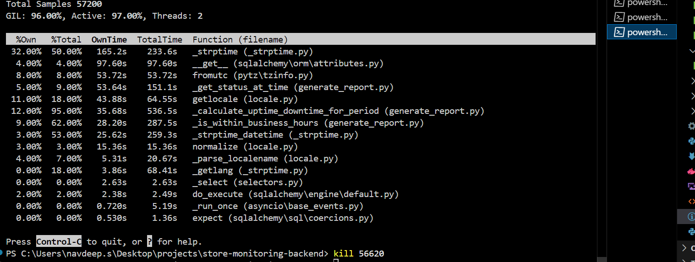
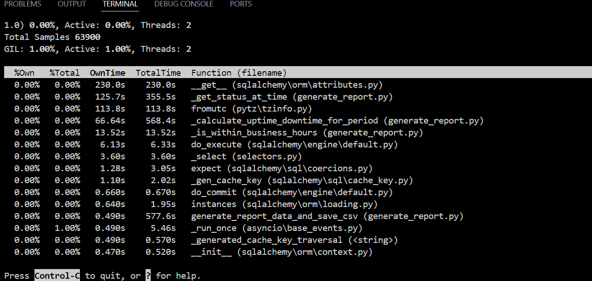

some assumptions i made

Database Design :-
    <!-- Earlier though of using status table id only as we are check stores status so we must be checking for all stores no
     -->
    1 Created a seperate table which only store store_id which is my master table for all stores
        Reason - There is posiiblity that store_id might not exists on all csv files as like for business hour
        if data is missing then its 24/7, and like if data is missing in timezone then its america/chicago
    2 Created a id inside all tables which is just a incremental value just to uniquely identify the record, if not done this way then store_id and timestamp can serve this purpose but i prefered creating this
    

    
    this is result for 36% done
    can clearly see date conversion is causing too much time, need to find the work around

    Updated timings:-
        Earlier report generation use to take 28 mins, but now ~10.26 mins i.e 60% faster than older approach.(both results exclude ingestion to db time, and include time take for printing logs on console i.e input/ouput stream connected).
    Results
    

    Why to change approach beacuse
    we are doing minutes-by-minutes iterations
        stores -        5,000
        status -        18,00,000
        menu_hours -    35,500
        timezone -      5000

    so for every minutes for 1 week we get -> 60*24*7 = 10080
    for single iteration -> timezone, convert_to_local, look_up menu_hours, look_up status

    so for 1 loop = 5,000 + 35,500 + 18,00,000 = 18,40,500
    for 10080     = 18,552,240,000

    ~18 Billion iteratition, which includes convert_to_local time and db queries for fetching all records

    Saturday :- 
    Optimized ingestion and algo, down to 3.50 min for ingestion and 1min for algo report
    